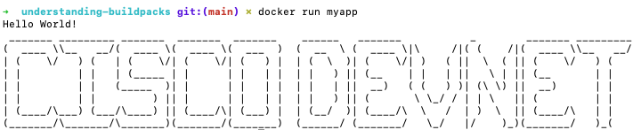

# understanding-buildpacks

This is a repo to learn how to use python buildpacks

Maintaining and building a `Dockerfile` can be a pain.

Buildpacks are here to save the day. They give you the ability to not have to worry about building a dockerfile.

Buildpacks were introduced by Heroku, in 2011, and adopted by Cloud Foundry, Gitlab, Knative and others.

Cloud Native Buildpacks began with Heroku and Pivotal in early 2018.

Cloud Native Buildpacks joined the CNCF in October 2018.

1. Build your app

    ```python
    print("Hello World!")

    with open('cisco_devnet.txt', 'r') as f:
            banner = f.read()

    print(banner)
    ```

2. Install buildpack tool to build the containers from buildpack

    https://buildpacks.io/docs/tools/pack/

3. Verify the version

    ```bash
    pack --version
    ```

4. Create the default builder for paketo

    ```bash
    pack config default-builder paketobuildpacks/builder:full
    ```

5. Create `Profile` and add your app there.

    `web: python hello.py`

6. Build your app using a python build pack

    ```bash
    pack build myapp --buildpack paketo-community/python@0.4.1
    ```

7. Run your app with docker

    `docker run myapp`

    

## Notes

Pass in your env... III. Config https://12factor.net/config

You don't have to worry about doing the dockerfile configuration

The build pack will automatically grab the `Procfile`, `buildpack.yml`, `requirements.txt`

Here's a sample buildpack: https://github.com/paketo-community/python/tree/main/integration/testdata/pip

To find build packs `https://registry.buildpacks.io/searches/python`

### About me

Introverted Network Automation Engineer that is changing lives as a Developer Advocate for Cisco DevNet. Pythons scripts are delicious. Especially at 2am on a Saturday night.

Contact Me:

- [LinkedIn](https://www.linkedin.com/in/duanlightfoot/)

- [Twitter](https://twitter.com/labeveryday)
